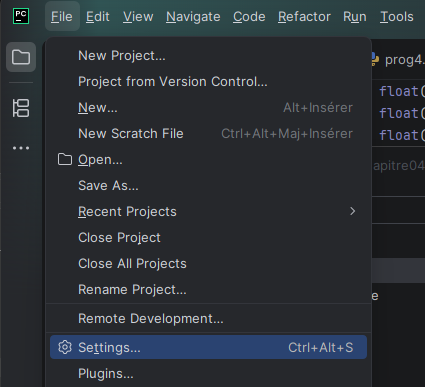
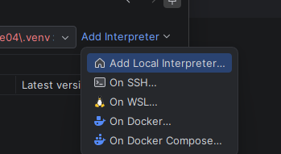
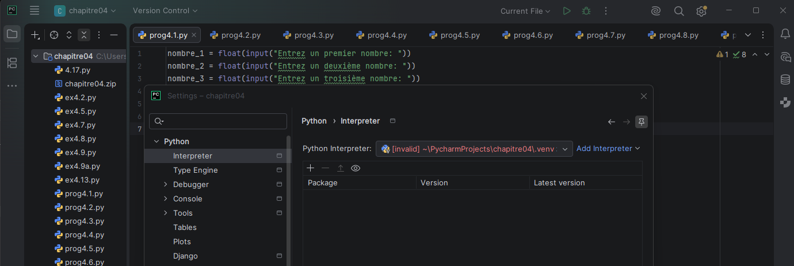
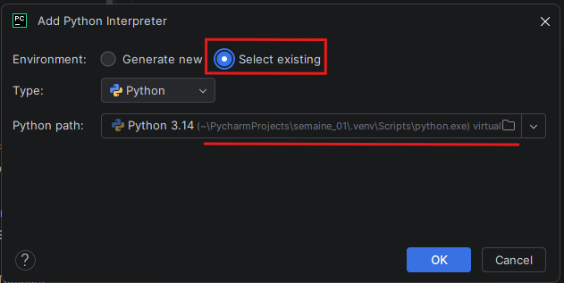
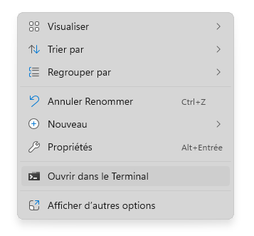
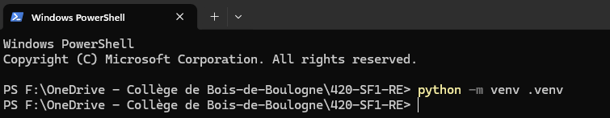

# Comment ré-utiliser le même .venv

PyCharm crée un environnement virtuel à chaque fois qu'on a un nouveau projet ou quand on importe un projet.

On peut ré-utiliser le .venv d'un autre projet ou même en créer un nouveau.

Choisir le dossier .venv de votre choix

C'est pratique car vous n'avez plus à installer matplotlib ni numpy.

## Créer son propre venv

Choisissez un dossier dans OneDrive.

Bouton de droite et vous obtenez un menu. Choisir "Ouvrir dans le terminal".

Tapez "python -m venv .venv" (sans les guillemets).

Cela va vous créer un sous-dossier .venv que vous pourrez utiliser pour PyCharm.

Si votre ordinateur roule sous MacOS/Linux/ChromeOS, vous aurez à refaire les mêmes étapes car les .venv ne sont pas compatibles.