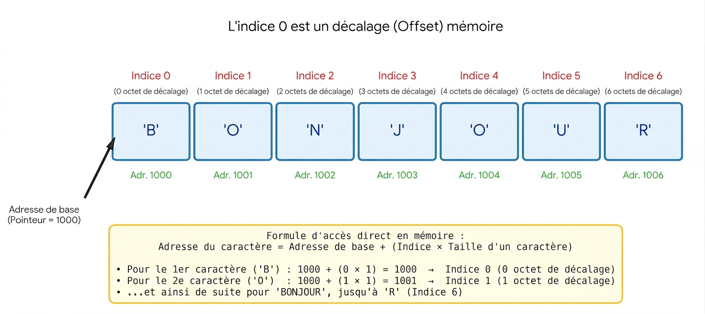

# **Les chaines (partie 2)**

Voir [partie 1](./420-SF1-RE-les_chaines_partie_1.md) au besoin.

Une chaine est composée de 0 ou de plusieurs caractères.

Pour connaitre le nombre de caractères dans une chaine, on utilise la fonction `len`

L'exécution de ce code   
`chaine = "Bonjour" # on utilise des guillemets "" ou des apostrophes ''`  
`print(len(chaine))`  
affichera la valeur 7  

`chaine = "Bonjour tout le monde"`  
`print(len(chaine))`  
affichera la valeur 24 car les espaces ' ' et les points d'exclamation '!'sont aussi comptés.  

Pour accéder à un caractère, on utilise les crochets [] et un indice (position)  
$\color{red}{\text{Attention:}}$  On commence à compter à partir de 0

`chaine = "Bonjour" `  
`print(chaine[0])`  
affichera le premier caractère 'B'.   
chaine[1] **ne donne pas** le premier caractère mais **le deuxième**.  

Historiquement, les caractères étaient placés de façon séquentielle en mémoire et l'indice n'était pas une position mais un décalage.

Le graphique suivant ne représente plus la réalité aujourd'hui mais ça vous donne une idée. 

En Python, ils ont gardé le 0 même si le code ne fait plus d'accès direct.

Par conséquent, le dernier caractère sera accessible via **chaine[6]** ou **chaine[len(chaine)-1]** ou **chaine[-1]**.   
Les deux dernières façons d'accéder au dernier caractère sont préférables. On évite l'accès à la dure comme chaine[6].

chaine[0], chaine[1], ..., chaine[len(chaine)-1]  
et pour partir de la fin  
chaine[-1] # r  
chaine[-2] # u  
chaine[-3] # o  
...  
chaine[-len(chaine)] # B  

Si on essayait d'accéder à un caractère avec un indice invalide comme chaine[len(chaine)], on obtiendrait  
$\color{red}{\text{IndexError: string index out of range}}$

On peut utiliser une boucle for pour accéder à chacun des caractères d'une chaine.  
`chaine = "Bon!"`    
`for i in range(len(chaine)):`  
&nbsp;&nbsp;&nbsp;&nbsp; `print(chaine[i])`    

L'affichage est  
B  
o  
n  
!  

Une autre façon d'extraire les caractère est  
`chaine = "Bon!"`    
`for caractere in chaine:`  
&nbsp;&nbsp;&nbsp;&nbsp; `print(caractere)`   

et cela donnera le même résultat.   

### Immuable  

Les chaines sont immuables. Cela veut dire que les chaines, une fois formées, ne sont plus modifiables.  

Si on a   
`chaine = "Bon"`  
`chaine += "jour!"`  

Vous allez probablement penser qu'on a modifié la chaine. En fait, la chaine 'Bon' existe toujours telle quelle en mémoire mais une nouvelle chaine 'Bonjour!' a été créée. La variable `chaine` pointe maintenant vers 'Bonjour!'.

Cela veut aussi dire qu'on ne peut pas modifier un caractère dans une chaine.

`chaine = "Bonjour!"`  
`chaine[0] = 'b'` # à ne pas faire  

On obtient ceci si on exécute le code précédent  
$\color{red}{\text{TypeError: 'str' object does not support item assignment}}$  
La phrase peut sembler cryptique mais cela veut dire les str ne peuvent pas être modifiées  

### Autres fonctions  

Pour savoir si un caractère se trouve dans une chaine, on peut utiliser  
`chaine = "Bonjour!"`  
`if 'o' in chaine:`  
&nbsp;&nbsp;&nbsp;&nbsp;`print(f"'o' a été trouvé")`  
`else:`  
&nbsp;&nbsp;&nbsp;&nbsp;`print(f"'o' n'a pas été trouvé")`  

#### find  
Si on veut connaitre sa position, on peut aussi utiliser  

`chaine = "Bonjour!"`  
`indice = chaine.find('o')`  
`if chaine.find('o') != -1:`  
&nbsp;&nbsp;&nbsp;&nbsp;`print(f"'o' a été trouvé à l'indice {indice}")`  
`else:`  
&nbsp;&nbsp;&nbsp;&nbsp;`print(f"'o' n'a pas été trouvé")`  

'o' a été trouvé à l'indice 1  

Il est possible de trouver la position de prochain 'o'  
`print(chaine.find("o", indice+1))`  

La fonction find retourne l'indice d'une sous-chaine (1 ou plusieurs caractères). Elle retourne -1 si la sous-chaine ne se trouve pas dans la chaine.  

`chaine = "Bonjour!"`  
`print(chaine.find("jour"))`  

#### count  
On peut compter le nombre de fois qu'une sous-chaine apparait dans une chaine  
`print(chaine.count("o"))` # 2   

#### replace  

On peut remplacer une sous-chaine par une autre sous-chaine  
`chaine = chaine.replace("o", "O")` # BOnjOur!  

Attention, replace ne modifie pas la chaine mais en crée une nouvelle  

#### upper et lower  
`chaine = chaine.upper()` # BONJOUR! Cela crée une nouvelle chaine en majuscule  
`chaine = chaine.lower()` # bonjour! Cela crée une nouvelle chaine en minuscule  

#### Tranchage  
Il est possible d'extraire une sous-chaine d'une chaine.  
C'est un peu similaire à l'instruction `range`.  

On peut écrire `chaine[début:fin:pas]` où la fin est exclue  
`sous_chaine = chaine[2:5:2]` # no i.e indice 2 puis indice 4  

Si le pas est 1, on peut écrire `chaine[début:fin]` ou `chaine[début:fin:]`  
Si la fin est le dernier caractère, on peut écrire `chaine[début::pas]`, etc  

`sous_chaine = chaine[4::]` # our! i.e. dernier est inclus et le pas est 1  
`sous_chaine = chaine[::]` # Bonjour! i.e toute la chaine  
`sous_chaine = chaine[::-1]` # !ruojnoB i.e. la chaine inversée  
